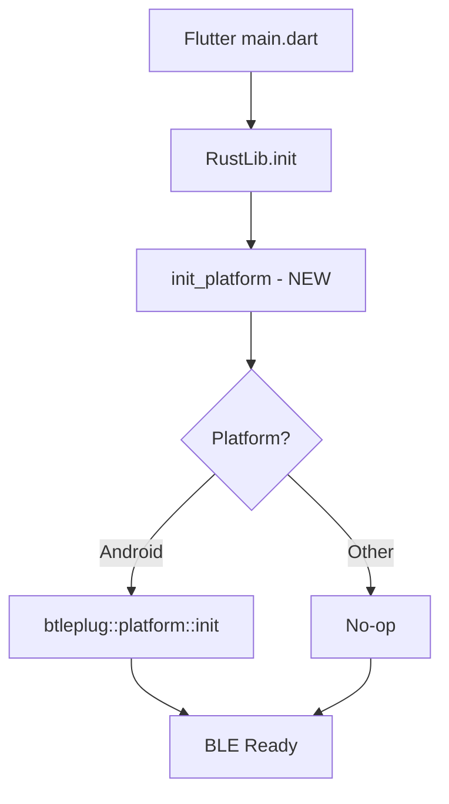

# Design Document

## Overview

Add Android-specific btleplug initialization to the Rust API layer. On Android, btleplug requires JNI environment and Android context to access Bluetooth APIs. This initialization must happen before any BLE operations.

## Steering Document Alignment

### Technical Standards (tech.md)
- Uses existing FRB infrastructure for Flutter-Rust communication
- Follows hexagonal architecture (initialization in api.rs, not adapters)
- Platform-specific code via cfg attributes

### Project Structure (structure.md)
- Changes limited to `rust/src/api.rs`
- Flutter changes in `lib/main.dart`

## Code Reuse Analysis

### Existing Components to Leverage
- **api.rs**: Add initialization function alongside existing init_logging/init_panic_handler
- **frb_generated**: FRB handles JNI context passing automatically

### Integration Points
- **Flutter main.dart**: Call initialization early in app startup
- **btleplug**: Use btleplug::platform::init() for Android

## Architecture

## Components and Interfaces

### init_platform Function
- **Purpose:** Initialize platform-specific BLE requirements
- **Interfaces:** `pub fn init_platform() -> Result<()>`
- **Dependencies:** btleplug, cfg attributes
- **Platform Logic:**
  - Android: Call btleplug::platform::init()
  - Other: Return Ok(())

## Error Handling

### Error Scenarios
1. **btleplug init fails:**
   - Handling: Log error, return Err with descriptive message
   - User Impact: App shows "BLE not available" error

2. **Called after BLE operations:**
   - Handling: Warning log, attempt init anyway
   - User Impact: None if successful

## Testing Strategy

### Unit Testing
- Test init_platform returns Ok on non-Android (mock)
- Cannot easily test Android init in unit tests

### Integration Testing
- Manual testing on Android device
- Verify BLE scan works after init
