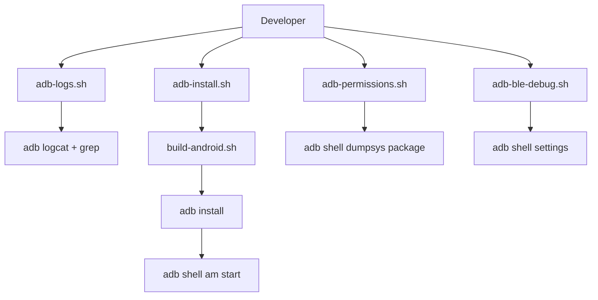

# Design Document

## Overview

Collection of bash scripts that wrap adb commands for common Android debugging tasks. Each script handles one specific concern and provides clear output.

## Steering Document Alignment

### Technical Standards (tech.md)
- Bash scripts following existing patterns
- Color output for readability
- Error handling with clear messages

### Project Structure (structure.md)
- All scripts in `scripts/` directory
- Naming convention: `adb-*.sh`

## Code Reuse Analysis

### Existing Components to Leverage
- **build-android.sh**: Reference for build commands
- **ble-*.sh scripts**: Reference for color output patterns
- **adb commands**: Standard Android debugging tools

### Integration Points
- **adb**: Android Debug Bridge
- **build-android.sh**: Called by adb-install.sh

## Architecture

## Components and Interfaces

### adb-logs.sh
- **Purpose:** Filter and display app logs
- **Usage:** `./scripts/adb-logs.sh [--follow]`
- **Output:** Colored, filtered logcat output

### adb-install.sh
- **Purpose:** Build and deploy to device
- **Usage:** `./scripts/adb-install.sh [--release]`
- **Output:** Build progress, install status, app launch

### adb-permissions.sh
- **Purpose:** Check app permissions
- **Usage:** `./scripts/adb-permissions.sh`
- **Output:** List of granted permissions with highlights

### adb-ble-debug.sh
- **Purpose:** Enable BLE HCI snoop logging
- **Usage:** `./scripts/adb-ble-debug.sh [enable|disable|status]`
- **Output:** Current BLE debug state, restart notification

## Error Handling

### Error Scenarios
1. **No device connected:**
   - Handling: Check `adb devices`, show instructions
   - User Impact: Clear message about connecting device

2. **Build fails:**
   - Handling: Show build error, suggest fixes
   - User Impact: See exact failure point

3. **Permission denied:**
   - Handling: Suggest enabling USB debugging
   - User Impact: Step-by-step instructions

## Testing Strategy

### Integration Testing
- Test each script with connected device
- Test error cases (no device, etc.)
- Verify output is readable
