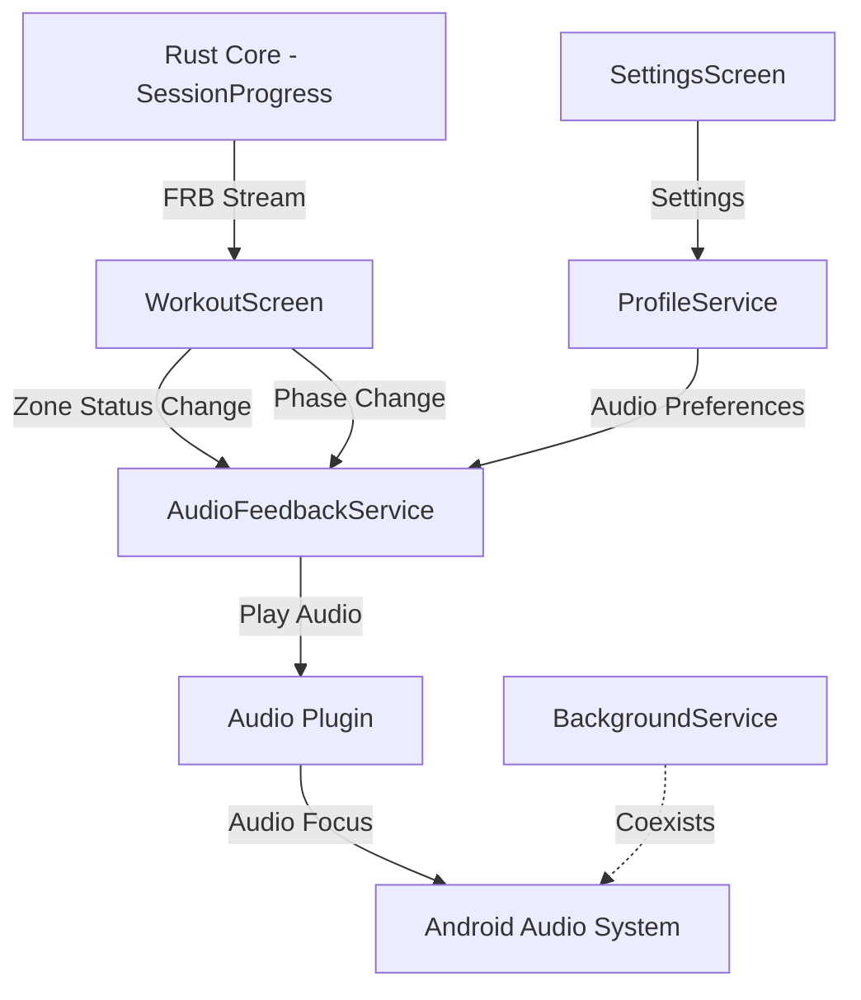

# Design Document

## Overview

Audio notifications provide real-time auditory feedback during training sessions to alert users when their heart rate deviates from target zones and when workout phases transition. This feature creates a complete biofeedback loop by allowing users to respond to guidance without visual attention to the screen, enabling safer and more natural exercise.

The implementation adds an AudioFeedbackService singleton that integrates with the existing WorkoutScreen session progress stream and BackgroundService to deliver timely, non-intrusive audio cues during active workouts.

## Steering Document Alignment

### Technical Standards (tech.md)

**Architecture Alignment:**
- **Hexagonal Architecture**: Audio service acts as an adapter implementing auditory feedback port
- **Dependency Injection**: AudioFeedbackService injected into WorkoutScreen via provider pattern
- **Performance Requirements**: Audio trigger latency < 100ms aligns with tech.md response time goal
- **Flutter Integration**: Uses Flutter plugin ecosystem following established pattern (flutter_background_service, permission_handler)

**Technology Stack:**
- **Dart/Flutter**: Audio service implemented in Flutter layer (not Rust core)
- **Asset Management**: Audio files bundled via pubspec.yaml asset configuration
- **State Management**: Audio settings persisted via SharedPreferences following ProfileService pattern
- **Testing**: Manual E2E testing on physical device (per CLI-first development strategy)

**Rationale for Flutter-layer Implementation:**
Audio feedback is a UI concern (user notification), not core business logic. Keeping it in Flutter:
1. Avoids FFI overhead for frequent audio triggers
2. Leverages Flutter audio plugin ecosystem
3. Simplifies integration with existing UI state streams
4. Follows separation of concerns (Rust = deterministic logic, Flutter = I/O and user feedback)

### Project Structure (structure.md)

**Directory Organization:**
```
lib/
├── src/
│   ├── services/
│   │   ├── audio_feedback_service.dart   # NEW: Audio playback service
│   │   ├── profile_service.dart          # EXTEND: Add audio settings
│   │   ├── background_service.dart       # REFERENCE: Service pattern
│   │   └── ...
│   ├── screens/
│   │   ├── workout_screen.dart           # MODIFY: Integrate audio triggers
│   │   ├── settings_screen.dart          # MODIFY: Add audio settings UI
│   │   └── ...
│   ├── widgets/
│   │   └── zone_feedback.dart            # REFERENCE: Zone status integration
│   └── models/
│       └── user_profile.dart             # EXTEND: Add audio preference fields
└── assets/
    └── audio/                             # NEW: Audio asset files
        ├── too_high.mp3
        ├── too_low.mp3
        └── phase_change.mp3
```

**Naming Conventions:**
- Service: `AudioFeedbackService` (PascalCase, singleton pattern)
- Files: `audio_feedback_service.dart` (snake_case)
- Methods: `playZoneTooHigh()`, `playZoneTooLow()` (camelCase)
- Assets: `too_high.mp3`, `too_low.mp3` (snake_case)

**Code Organization:**
- Max ~200 lines for AudioFeedbackService (simple playback + state)
- Max ~50 lines added to WorkoutScreen (zone change detection + triggers)
- Max ~100 lines added to SettingsScreen (UI controls)

## Code Reuse Analysis

### Existing Components to Leverage

1. **ProfileService** (`lib/src/services/profile_service.dart`)
   - **Pattern reuse**: Singleton pattern with `getInstance()` factory
   - **Storage reuse**: SharedPreferences persistence pattern for audio settings
   - **Stream pattern**: Broadcast stream for settings change notifications
   - **Extension**: Add `audioFeedbackEnabled`, `audioVolume` fields to UserProfile model

2. **BackgroundService** (`lib/src/services/background_service.dart`)
   - **Pattern reuse**: Service initialization flow (`initializeService()` before `startService()`)
   - **Android integration**: Audio must work during foreground service (screen off)
   - **Audio focus**: Reference Android audio focus management patterns

3. **WorkoutScreen** (`lib/src/screens/workout_screen.dart`)
   - **Integration point**: Session progress stream already provides `ApiZoneStatus` updates
   - **State tracking**: `_zoneStatus`, `_currentPhaseName`, `_currentState` available for audio triggers
   - **Pattern reuse**: Stream subscription pattern for real-time updates

4. **ZoneFeedbackWidget** (`lib/src/widgets/zone_feedback.dart`)
   - **Zone logic reuse**: `isInZone()`, `isTooLow()`, `isTooHigh()` helper methods
   - **Integration reference**: Visual feedback already synchronized with zone status

5. **SessionScreen** (`lib/src/screens/session_screen.dart`)
   - **Zone calculation**: `ProfileService.getZoneForBpm(bpm)` pattern for zone determination
   - **Stream pattern**: StreamBuilder integration with Rust API

### Integration Points

1. **WorkoutScreen Progress Stream** (`lib/src/screens/workout_screen.dart`)
   - **Current behavior**: Receives `ApiSessionProgress` updates, extracts zone status
   - **Audio integration**: Add audio triggers when `_zoneStatus` changes
   - **Debouncing**: Track last audio time to prevent spam during zone boundary oscillation
   - **Phase transitions**: Detect `_currentPhaseName` changes to trigger phase audio

2. **UserProfile Model** (`lib/src/models/user_profile.dart`)
   - **Current fields**: `maxHr`, `age`, `useAgeBased`, `customZones`
   - **Extension**: Add `audioFeedbackEnabled` (bool, default: true), `audioVolume` (double, default: 0.7)
   - **JSON serialization**: Extend `toJson()`/`fromJson()` for new fields

3. **SettingsScreen** (`lib/src/screens/settings_screen.dart`)
   - **Current structure**: Card-based settings sections (Max HR, Training Zones)
   - **Extension**: Add "Audio Feedback" card with toggle and volume slider
   - **Save flow**: Update profile via `ProfileService.saveProfile()`

4. **Background Service Audio Focus** (`lib/src/services/background_service.dart`)
   - **Coordination**: Audio must coexist with foreground notification
   - **Android policy**: Audio service must request and handle audio focus (duck other audio)

## Architecture

### System Overview

The audio feedback system follows a reactive architecture where audio cues are triggered by state changes in the workout session. The AudioFeedbackService acts as a stateless adapter between workout state streams and platform audio APIs.



### Data Flow

1. **Session Progress Updates** (every HR reading)
   ```
   Rust api.createSessionProgressStream()
   → WorkoutScreen._progressSubscription
   → Extract zoneStatus, phaseName, sessionState
   → Compare with previous state
   → IF changed AND session running THEN trigger audio
   ```

2. **Audio Trigger Logic** (WorkoutScreen)
   ```
   IF zoneStatus changed from InZone to TooLow
      AND (now - lastAudioTime) > 5 seconds
      AND sessionState == Running
      AND audioEnabled
   THEN AudioFeedbackService.playZoneTooLow()
   ```

3. **Audio Playback** (AudioFeedbackService)
   ```
   Load audio settings from ProfileService
   IF audioEnabled == false THEN return
   Request audio focus (duck other audio)
   Play audio asset at configured volume
   Release audio focus
   ```

4. **Settings Update** (SettingsScreen)
   ```
   User toggles audio or adjusts volume
   → Update UserProfile model
   → ProfileService.saveProfile()
   → AudioFeedbackService reads new settings on next trigger
   ```

### Modular Design Principles

- **Single File Responsibility**: AudioFeedbackService handles only audio playback, not zone logic or state management
- **Component Isolation**: Audio service has no dependencies on WorkoutScreen; integrated via loose coupling
- **Service Layer Separation**: WorkoutScreen (presentation) → ProfileService (data) → AudioFeedbackService (I/O)
- **Utility Modularity**: Audio asset preloading and debouncing logic encapsulated in service

## Components and Interfaces

### Component 1: AudioFeedbackService

- **Purpose:** Singleton service for playing audio feedback cues during workouts
- **Location:** `lib/src/services/audio_feedback_service.dart`
- **Interfaces:**
  - `Future<void> initialize()` - Preload audio assets, setup audio session
  - `Future<void> playZoneTooHigh()` - Play "too high" audio cue
  - `Future<void> playZoneTooLow()` - Play "too low" audio cue
  - `Future<void> playPhaseTransition()` - Play phase change audio cue
  - `void dispose()` - Release audio resources
  - `static AudioFeedbackService getInstance()` - Singleton accessor
- **Dependencies:**
  - Audio plugin (audioplayers or just_audio, TBD in task 1)
  - ProfileService (for audio settings)
  - Flutter AssetBundle (for loading assets)
- **Reuses:**
  - ProfileService singleton pattern
  - BackgroundService initialization pattern
- **State:**
  - `AudioPlayer` instance(s) for audio playback
  - Cached audio settings (enabled, volume) from ProfileService
  - Audio asset paths (constants)

### Component 2: WorkoutScreen Audio Integration

- **Purpose:** Trigger audio feedback based on session progress state changes
- **Location:** `lib/src/screens/workout_screen.dart` (modifications)
- **Interfaces:** (internal, no new public API)
  - `_onProgressUpdate(ApiSessionProgress progress)` - Enhanced to detect changes and trigger audio
  - `_triggerZoneAudio(ApiZoneStatus status)` - Debounced audio trigger
  - `_triggerPhaseAudio(String phaseName)` - Phase transition audio
- **Dependencies:**
  - AudioFeedbackService.getInstance()
  - Existing session progress stream
  - DateTime.now() for debouncing
- **Reuses:**
  - Existing `_progressSubscription` stream handling
  - Existing zone status helpers from ZoneFeedbackWidget
- **State:**
  - `_lastAudioTime` - DateTime of last audio trigger (debouncing)
  - `_lastZoneStatus` - Previous zone status (change detection)
  - `_lastPhaseName` - Previous phase name (transition detection)

### Component 3: SettingsScreen Audio Controls

- **Purpose:** UI for enabling/disabling audio feedback and adjusting volume
- **Location:** `lib/src/screens/settings_screen.dart` (modifications)
- **Interfaces:** (UI, no public API)
  - Audio feedback toggle switch
  - Volume slider (0.0-1.0 with step 0.1)
  - Save button triggers profile update
- **Dependencies:**
  - ProfileService.getInstance()
  - UserProfile model (extended with audio fields)
- **Reuses:**
  - Existing settings card layout
  - Existing profile save flow
- **State:**
  - Local widget state for toggle and slider (synced with UserProfile)

### Component 4: UserProfile Model Extensions

- **Purpose:** Persist audio feedback preferences across app restarts
- **Location:** `lib/src/models/user_profile.dart` (modifications)
- **Interfaces:**
  - `bool audioFeedbackEnabled` - Getter/setter (default: true)
  - `double audioVolume` - Getter/setter (default: 0.7, range: 0.0-1.0)
  - `toJson()` / `fromJson()` - Extended serialization
- **Dependencies:**
  - None (data model)
- **Reuses:**
  - Existing JSON serialization pattern
  - Existing validation pattern (e.g., maxHr bounds checking)
- **State:**
  - `bool _audioFeedbackEnabled`
  - `double _audioVolume` (validated: 0.0-1.0)

### Component 5: Audio Asset Files

- **Purpose:** Provide distinct, non-intrusive audio cues for feedback
- **Location:** `assets/audio/` directory
- **Files:**
  - `too_high.mp3` - Played when HR exceeds target zone upper bound
  - `too_low.mp3` - Played when HR falls below target zone lower bound
  - `phase_change.mp3` - Played when workout phase transitions
- **Requirements:**
  - File size < 100KB each (fast loading)
  - Duration ~500ms-1s (brief, non-intrusive)
  - Distinct tones (easily distinguishable)
  - Appropriate for exercise context (motivational, not alarming)
- **Asset Registration:**
  - Added to `pubspec.yaml` flutter assets section
  - Verified in release build

## Data Models

### Extended UserProfile Model

```dart
class UserProfile {
  // Existing fields
  int _maxHr;
  int? _age;
  bool _useAgeBased;
  CustomZones? _customZones;

  // NEW: Audio feedback fields
  bool _audioFeedbackEnabled;  // Default: true
  double _audioVolume;         // Default: 0.7, Range: 0.0-1.0

  // Getters
  bool get audioFeedbackEnabled => _audioFeedbackEnabled;
  double get audioVolume => _audioVolume;

  // Setters (with validation)
  set audioFeedbackEnabled(bool value) {
    _audioFeedbackEnabled = value;
  }

  set audioVolume(double value) {
    if (value < 0.0 || value > 1.0) {
      throw ArgumentError('audioVolume must be between 0.0 and 1.0');
    }
    _audioVolume = value;
  }

  // JSON serialization (extended)
  Map<String, dynamic> toJson() => {
    'maxHr': _maxHr,
    'age': _age,
    'useAgeBased': _useAgeBased,
    'customZones': _customZones?.toJson(),
    'audioFeedbackEnabled': _audioFeedbackEnabled,  // NEW
    'audioVolume': _audioVolume,                    // NEW
  };

  factory UserProfile.fromJson(Map<String, dynamic> json) => UserProfile(
    maxHr: json['maxHr'] as int,
    age: json['age'] as int?,
    useAgeBased: json['useAgeBased'] as bool,
    customZones: json['customZones'] != null
        ? CustomZones.fromJson(json['customZones'])
        : null,
    audioFeedbackEnabled: json['audioFeedbackEnabled'] as bool? ?? true,  // NEW (default true)
    audioVolume: (json['audioVolume'] as num?)?.toDouble() ?? 0.7,        // NEW (default 0.7)
  );
}
```

### AudioFeedbackService State

```dart
class AudioFeedbackService {
  static AudioFeedbackService? _instance;

  AudioPlayer? _player;  // Plugin-specific player instance
  bool _initialized = false;

  // Audio asset paths (constants)
  static const String _assetTooHigh = 'assets/audio/too_high.mp3';
  static const String _assetTooLow = 'assets/audio/too_low.mp3';
  static const String _assetPhaseChange = 'assets/audio/phase_change.mp3';

  // Singleton accessor
  static AudioFeedbackService getInstance() {
    _instance ??= AudioFeedbackService._internal();
    return _instance!;
  }

  // Private constructor
  AudioFeedbackService._internal();

  // Methods (see Component 1 interfaces)
}
```

### WorkoutScreen Debouncing State

```dart
class _WorkoutScreenState extends State<WorkoutScreen> {
  // Existing state
  ApiSessionProgress? _currentProgress;
  ApiZoneStatus? _zoneStatus;
  String? _currentPhaseName;
  String _currentState = 'Unknown';

  // NEW: Audio feedback state
  DateTime? _lastAudioTime;         // For debouncing zone audio
  ApiZoneStatus? _lastZoneStatus;   // For change detection
  String? _lastPhaseName;           // For phase transition detection

  static const Duration _audioDebounceInterval = Duration(seconds: 5);
}
```

## Error Handling

### Error Scenarios

1. **Audio Package Initialization Failure**
   - **Handling:** Log error via tracing, set `_initialized = false`, return early from play methods
   - **User Impact:** No audio feedback (silent failure), visual feedback still works
   - **Rationale:** Audio is enhancement, not critical feature; visual feedback provides fallback

2. **Audio Asset Missing or Failed to Load**
   - **Handling:** Catch asset loading exception, log error with file path, skip audio playback
   - **User Impact:** Specific audio cue missing, other cues may still work
   - **Recovery:** Check pubspec.yaml asset registration, verify file paths

3. **Audio Focus Request Denied (Android)**
   - **Handling:** Attempt playback anyway (transient focus), log warning
   - **User Impact:** Audio may duck or be silenced by other apps (e.g., music player)
   - **Rationale:** Defer to Android audio policy, user has implicit control via other app

4. **Settings Load Failure (SharedPreferences)**
   - **Handling:** ProfileService handles this; AudioFeedbackService uses safe defaults (enabled=true, volume=0.7)
   - **User Impact:** Audio plays with default settings until preferences load
   - **Rationale:** Fail-safe defaults ensure audio works out-of-box

5. **Audio Playback During Paused Session**
   - **Handling:** Check `_currentState == 'Running'` before triggering audio
   - **User Impact:** No audio when session is paused (correct behavior)
   - **Prevention:** Gate audio triggers on session state

6. **Excessive Audio Triggering (Zone Boundary Oscillation)**
   - **Handling:** Debounce audio triggers with 5-second minimum interval
   - **User Impact:** Maximum one audio cue per 5 seconds (prevents spam)
   - **Implementation:** Track `_lastAudioTime`, skip trigger if within interval

## Testing Strategy

### Unit Testing

**AudioFeedbackService:**
- Mock audio player plugin
- Test `initialize()` preloads assets correctly
- Test `playZoneTooHigh()` calls player with correct asset and volume
- Test disabled state (audioEnabled=false) prevents playback
- Test volume scaling applied correctly (0.0-1.0)

**UserProfile Model Extensions:**
- Test JSON serialization with audio fields
- Test backward compatibility (loading old profiles without audio fields)
- Test validation (audioVolume bounds checking)
- Test default values (enabled=true, volume=0.7)

### Integration Testing

**WorkoutScreen Audio Integration:**
- Mock AudioFeedbackService
- Simulate zone status changes in progress stream
- Verify audio triggered on zone deviation (InZone → TooLow, InZone → TooHigh)
- Verify audio NOT triggered on same status (TooLow → TooLow)
- Verify debouncing (multiple triggers within 5s → single audio)
- Verify session state gating (audio only when Running, not Paused)
- Verify phase transition detection (phaseName change → phase audio)

**SettingsScreen Persistence:**
- Mock ProfileService
- Toggle audio setting, verify profile updated and saved
- Adjust volume, verify profile updated and saved
- Reload settings screen, verify values restored from profile

### End-to-End Testing

**Physical Device Testing (Android):**
1. **Basic Audio Playback:**
   - Start workout, go below zone → Hear "too low" audio
   - Increase intensity, go above zone → Hear "too high" audio
   - Return to zone → No audio (only deviation triggers audio)
   - Phase transition → Hear phase change audio

2. **Background Service Integration:**
   - Start workout, lock screen → Audio still plays
   - Verify audio focus: Play music, trigger zone audio → Music ducks, audio plays
   - Unlock screen → Visual and audio feedback synchronized

3. **Settings Persistence:**
   - Disable audio in settings → No audio during workout
   - Re-enable audio → Audio plays again
   - Adjust volume to 0.3 → Audio quieter
   - Adjust volume to 1.0 → Audio louder
   - Kill app, restart → Settings restored

4. **Debouncing:**
   - Hover at zone boundary (oscillating in/out) → Max one audio per 5 seconds
   - Verify no audio spam during HR noise/artifacts

5. **Session Control:**
   - Pause workout → No audio during pause
   - Resume workout → Audio resumes on zone changes
   - Stop workout → No audio after stop

6. **Battery Impact:**
   - Run 60-minute workout with audio enabled
   - Compare battery drain vs without audio (should be negligible)

**Test Devices:**
- Primary: Physical Android device (API 26+)
- Secondary: Linux CLI (no audio support, but verify no crashes)

**Success Criteria:**
- Audio plays reliably within 100ms of trigger
- Audio works with screen off (foreground service)
- Settings persist across app restarts
- No audio spam during zone oscillation
- Battery impact < 2% over 60 minutes
- Graceful degradation if audio unavailable
