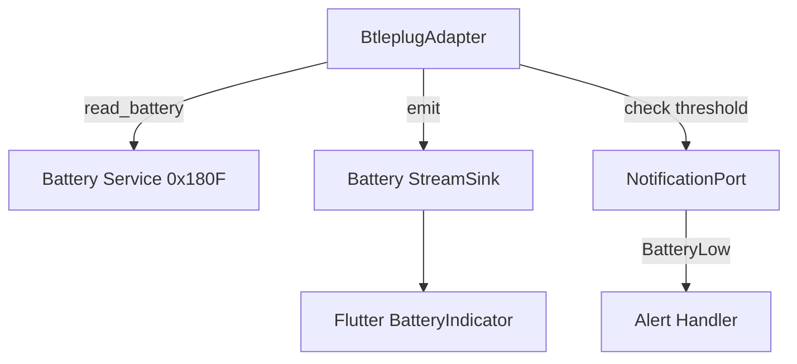

# Design Document

## Overview

Battery monitoring adds periodic battery level polling to the existing BLE connection, emitting battery levels to Flutter for display and generating alerts when battery is low.

## Steering Document Alignment

### Technical Standards (tech.md)
- Uses btleplug for BLE battery characteristic reads
- Follows hexagonal architecture with BatteryPort trait
- Integrates with existing NotificationPort for alerts

### Project Structure (structure.md)
- Battery polling in `rust/src/adapters/btleplug_adapter.rs` (extends existing)
- Battery state in `rust/src/domain/battery.rs` (new)
- UI widget already exists: `lib/src/widgets/battery_indicator.dart`

## Code Reuse Analysis

### Existing Components to Leverage
- **BtleplugAdapter**: Already connected to device, add battery read method
- **NotificationPort**: Use for BatteryLow event emission
- **api.rs**: Add battery stream alongside HR stream
- **battery_indicator.dart**: Widget exists, needs data connection

### Integration Points
- **BLE Connection**: Piggyback on existing connection for battery reads
- **Stream Architecture**: Use same broadcast channel pattern as HR

## Architecture



## Components and Interfaces

### BatteryLevel Domain Type
- **Purpose:** Represent battery state
- **Interfaces:** `level: Option<u8>`, `is_low()`, `timestamp`
- **Dependencies:** None (pure domain)

### Battery Polling (in BtleplugAdapter)
- **Purpose:** Periodically read battery characteristic
- **Interfaces:** `start_battery_polling()`, `stop_battery_polling()`
- **Dependencies:** btleplug, tokio::interval
- **Reuses:** Existing BLE connection handle

### API Extension
- **Purpose:** Expose battery stream to Flutter
- **Interfaces:** `create_battery_stream() -> Stream<BatteryLevel>`
- **Reuses:** api.rs broadcast channel pattern

## Data Models

### BatteryLevel
```rust
pub struct BatteryLevel {
    pub level: Option<u8>,  // 0-100 or None if unknown
    pub is_charging: bool,  // If device reports charging
    pub timestamp: SystemTime,
}
```

## Error Handling

### Error Scenarios
1. **Battery Service Not Supported**
   - **Handling:** Return None for battery level, continue operation
   - **User Impact:** Battery indicator shows "?" icon

2. **Battery Read Failed**
   - **Handling:** Log warning, retry on next interval
   - **User Impact:** Previous battery level remains displayed

## Testing Strategy

### Unit Testing
- Test BatteryLevel::is_low() threshold logic
- Test battery level parsing from BLE characteristic

### Integration Testing
- Test battery polling with mock adapter
- Test BatteryLow notification emission
