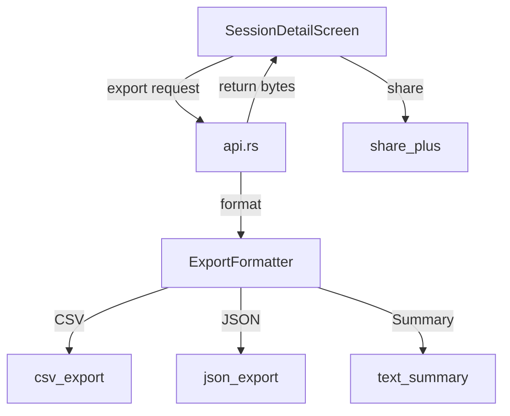

# Design Document

## Overview

Data export adds CSV, JSON, and text summary export capabilities for completed sessions. Exports are generated in Rust and shared via Flutter's share functionality.

## Steering Document Alignment

### Technical Standards (tech.md)
- JSON already used for training plans and sessions
- Rust handles data formatting for type safety
- Flutter handles platform share sheets

### Project Structure (structure.md)
- Export logic in `rust/src/domain/export.rs`
- API in `rust/src/api.rs`
- Flutter share in `lib/src/services/share_service.dart`

## Code Reuse Analysis

### Existing Components to Leverage
- **CompletedSession**: Already has all data for export
- **serde_json**: For JSON export
- **SessionSummary**: For text summary generation

### Integration Points
- **SessionDetailScreen**: Add export buttons
- **HistoryScreen**: Add batch export selection
- **share_plus package**: Flutter sharing

## Architecture



## Components and Interfaces

### ExportFormat Enum
- **Purpose:** Specify export type
- **Variants:** CSV, JSON, TextSummary

### Export Functions in Rust
- **Purpose:** Generate export content
- **Interfaces:** `export_session_csv(session) -> String`, `export_session_json(session) -> String`, `export_session_summary(session) -> String`
- **Dependencies:** CompletedSession, serde

### ShareService in Flutter
- **Purpose:** Platform share integration
- **Interfaces:** `shareFile(path, mimeType)`, `shareText(text)`
- **Dependencies:** share_plus package

## Data Models

### CSV Format
```csv
timestamp,bpm,zone,phase
2026-01-12T10:00:00Z,120,Zone2,Warmup
2026-01-12T10:01:00Z,135,Zone3,Work
...
```

### Text Summary Format
```
Heart Beat Training Session
===========================
Date: January 12, 2026
Plan: Tempo Run
Duration: 45:00

Heart Rate Summary
- Average: 145 BPM
- Maximum: 165 BPM
- Minimum: 95 BPM

Time in Zones
- Zone 1 (Recovery): 5:00 (11%)
- Zone 2 (Endurance): 15:00 (33%)
- Zone 3 (Tempo): 20:00 (44%)
- Zone 4 (Threshold): 5:00 (11%)
- Zone 5 (Max): 0:00 (0%)
```

## Error Handling

### Error Scenarios
1. **Share Sheet Unavailable**
   - **Handling:** Save to local file, show path
   - **User Impact:** "File saved to Downloads"

2. **No Sessions Selected**
   - **Handling:** Disable export button
   - **User Impact:** Button greyed out

## Testing Strategy

### Unit Testing
- Test CSV format output correctness
- Test JSON serialization matches schema
- Test summary text formatting

### Integration Testing
- Test export -> share flow
- Test batch export ZIP generation
