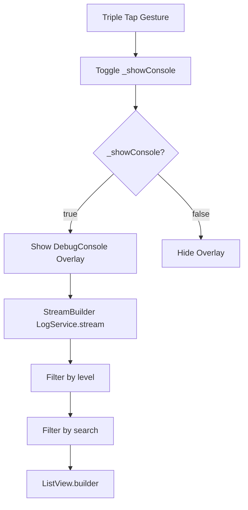

# Design Document

## Overview

A floating overlay widget that displays real-time logs from LogService. Supports level filtering, text search, and can be toggled via triple-tap gesture. Only available in debug builds.

## Steering Document Alignment

### Technical Standards (tech.md)
- Flutter Material Design 3 components
- StreamBuilder for reactive updates
- Overlay widget for non-intrusive display

### Project Structure (structure.md)
- Widget in `lib/src/widgets/debug_console.dart`
- Integration in `lib/src/app.dart` (wrap with gesture detector)

## Code Reuse Analysis

### Existing Components to Leverage
- **LogService**: Stream of logs for display
- **Material Theme**: Existing app colors and typography
- **Overlay/OverlayEntry**: Flutter built-in for floating UI

### Integration Points
- **app.dart**: Wrap MaterialApp with GestureDetector for toggle
- **LogService.stream**: Subscribe for live updates

## Architecture



## Components and Interfaces

### DebugConsole Widget
- **Purpose:** Display filtered logs in overlay
- **Interfaces:**
  - Constructor: `DebugConsole({required VoidCallback onClose})`
  - Uses LogService.instance internally
- **Dependencies:** LogService, Material widgets
- **State:**
  - `_levelFilter`: LogLevel enum (debug, info, warn, error)
  - `_searchQuery`: String for text filter
  - `_logs`: Filtered list for display

### DebugConsoleOverlay (StatefulWidget)
- **Purpose:** Manage overlay visibility at app level
- **Interfaces:**
  - Wrap child widget
  - Handle triple-tap gesture
- **Dependencies:** Overlay, GestureDetector

## Data Models

### LogLevel Enum
```dart
enum LogLevel {
  debug,
  info,
  warn,
  error;

  Color get color => switch (this) {
    debug => Colors.grey,
    info => Colors.blue,
    warn => Colors.orange,
    error => Colors.red,
  };
}
```

## Error Handling

### Error Scenarios
1. **LogService not initialized:**
   - Handling: Show "Logging not initialized" message
   - User Impact: Console visible but empty

2. **Too many logs:**
   - Handling: Limit to 200 most recent
   - User Impact: Older logs not visible

## Testing Strategy

### Unit Testing
- Test log filtering logic
- Test level color mapping

### Widget Testing
- Test console renders logs
- Test filter changes update list
- Test triple-tap toggles visibility
