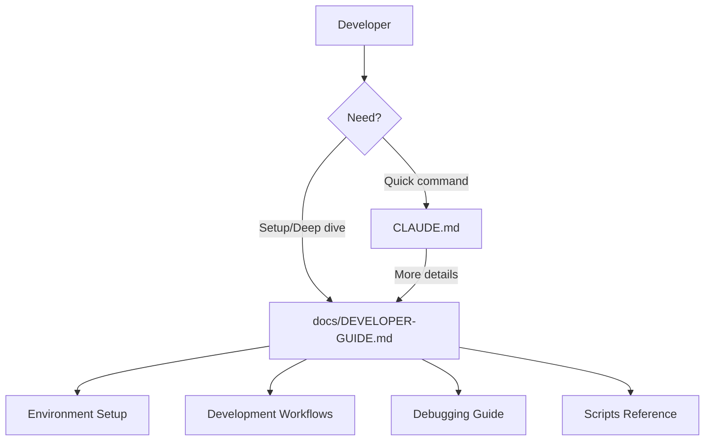

# Design Document

## Overview

Two-tier documentation structure: CLAUDE.md for quick reference (always visible to AI), DEVELOPER-GUIDE.md for comprehensive information.

## Steering Document Alignment

### Technical Standards (tech.md)
- CLI-first development documented
- Debug mode usage explained
- All development workflows covered

### Project Structure (structure.md)
- CLAUDE.md in project root
- DEVELOPER-GUIDE.md in docs/ directory

## Code Reuse Analysis

### Existing Components to Leverage
- **Existing CLAUDE.md**: Extend with quick reference section
- **Plan document**: Reference for workflow descriptions
- **scripts/**: Document all helper scripts

### Integration Points
- **CLAUDE.md**: Links to DEVELOPER-GUIDE.md
- **Scripts**: Referenced with usage examples

## Architecture

## Components and Interfaces

### CLAUDE.md Quick Reference Section
- **Purpose:** Immediate access to common commands
- **Contents:**
  - Command table (Linux CLI, Desktop, Android)
  - Log level examples
  - Link to full guide

### docs/DEVELOPER-GUIDE.md
- **Purpose:** Comprehensive developer documentation
- **Sections:**
  1. Environment Setup (Linux deps, Android SDK/NDK, Flutter)
  2. Development Workflows (CLI, Desktop, Android)
  3. Debugging (console, logging, logcat, HCI snoop)
  4. Scripts Reference (all helper scripts)
  5. Architecture Overview (Rust core, Flutter bridge)

## Error Handling

### Error Scenarios
1. **Outdated documentation:**
   - Handling: Review docs when scripts change
   - User Impact: Confusion from stale info

## Testing Strategy

### Verification
- Run documented commands to verify accuracy
- Test setup instructions on clean environment
