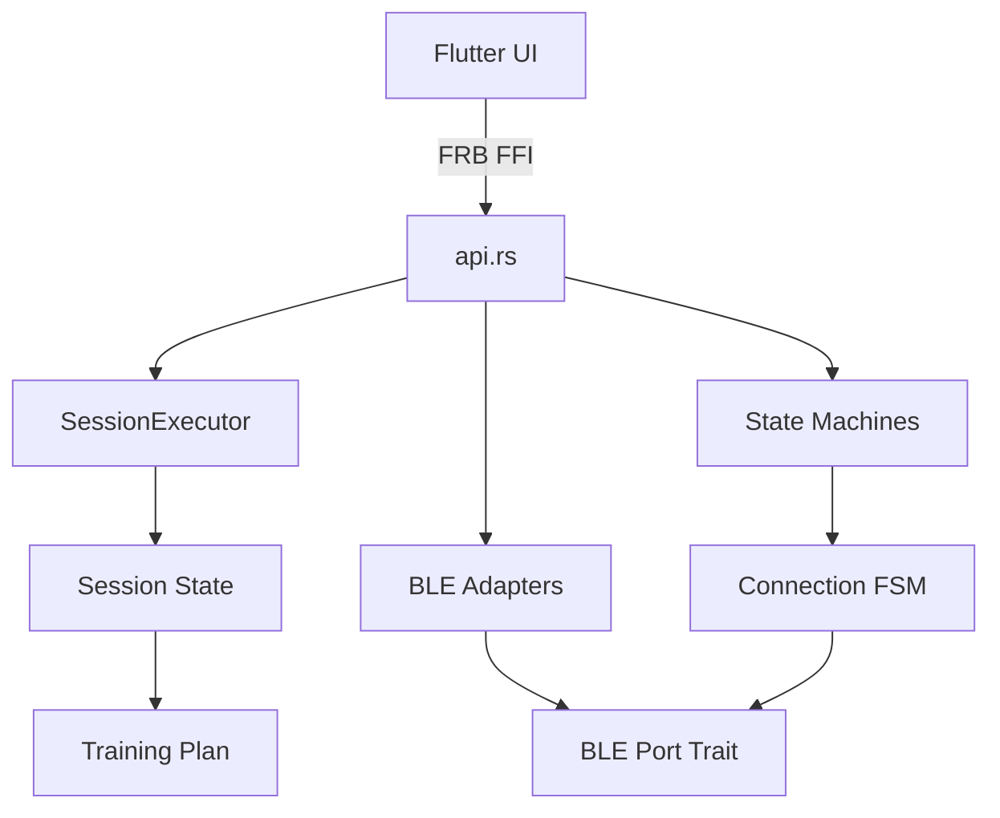

# Design Document

## Documentation Structure

```
heart-beat2/
├── README.md                    # Quick start, project overview
├── CONTRIBUTING.md              # Contribution guide
├── docs/
│   ├── architecture.md          # System design and structure
│   ├── development.md           # Developer setup and workflow
│   ├── user-guide.md            # End-user manual
│   ├── api-examples.md          # Code examples
│   └── plans/                   # Training plan templates
│       ├── README.md
│       ├── beginner-base.json
│       ├── 5k-training.json
│       └── marathon-pace.json
├── examples/                    # Runnable code examples
│   ├── README.md
│   ├── basic_scan.rs
│   ├── stream_hr.rs
│   └── mock_session.rs
└── rust/src/
    ├── domain/README.md         # Domain module docs
    ├── state/README.md          # State module docs
    └── ...
```

## README.md Template

```markdown
# Heart Beat - HR Training Telemetry System

[](...)
[](...)
[](...)

Deterministic heart rate training system with real-time biofeedback for the Coospo HW9 optical heart rate monitor.

## Features

- 🏃 **Planned Training Execution** - Auto-progressing workout phases with zone-based transitions
- 📊 **Real-time HR Streaming** - Kalman-filtered BPM with <100ms latency
- 🎯 **Biofeedback Loop** - Audio/visual alerts when outside target zone
- 📈 **HRV Analysis** - RMSSD/SDNN calculation for recovery monitoring
- 🖥️  **CLI-First Development** - Full feature testing without Android deployment
- 📱 **Cross-Platform** - Linux CLI + Android app (iOS planned)

## Tech Stack

- **Rust** - Core logic with zero GC pauses
- **Flutter** - Cross-platform UI
- **FRB v2** - Type-safe Rust ↔ Dart FFI
- **statig** - Hierarchical state machines
- **btleplug** - BLE communication

## Quick Start

### CLI (Linux)

```bash
# Install Rust
curl --proto '=https' --tlsv1.2 -sSf https://sh.rustup.rs | sh

# Build and run
cd rust
cargo build --release
./target/release/cli devices scan
./target/release/cli session start docs/plans/tempo-run.json
```

### Mobile App (Android)

```bash
# Prerequisites: Flutter 3.16+, Android SDK
flutter pub get
flutter run --release
```

## Project Structure

[Tree diagram...]

## Documentation

- [Architecture Guide](docs/architecture.md) - System design
- [User Manual](docs/user-guide.md) - Training plans and usage
- [API Examples](docs/api-examples.md) - Code examples
- [Development Guide](docs/development.md) - Contributing

## License

MIT
```

## Architecture Documentation

Uses Mermaid diagrams:



## Doc Comment Standards

### Function Documentation
```rust
/// Calculates the heart rate zone for a given BPM.
///
/// Uses the percentage of max heart rate to determine training zones:
/// - Zone 1: 50-60% (Recovery)
/// - Zone 2: 60-70% (Endurance)
/// - Zone 3: 70-80% (Tempo)
/// - Zone 4: 80-90% (Threshold)
/// - Zone 5: 90-100% (VO2 Max)
///
/// # Arguments
///
/// * `bpm` - Current heart rate in beats per minute
/// * `max_hr` - Maximum heart rate (typically 220 - age)
///
/// # Returns
///
/// - `Ok(Some(Zone))` - The calculated zone
/// - `Ok(None)` - BPM is below training threshold (<50% max HR)
/// - `Err` - Invalid max_hr (<100 or >220)
///
/// # Examples
///
/// ```
/// use heart_beat::calculate_zone;
///
/// let zone = calculate_zone(140, 180).unwrap();
/// assert_eq!(zone, Some(Zone::Zone3)); // 140 is 77% of 180
/// ```
pub fn calculate_zone(bpm: u16, max_hr: u16) -> Result<Option<Zone>> {
    // ...
}
```

## User Manual Style

Use friendly, non-technical language:

```markdown
## Understanding Heart Rate Zones

When you exercise, your heart rate tells you how hard your body is working. Training in specific heart rate "zones" helps you meet different fitness goals:

**Zone 1 - Active Recovery (50-60% max HR)**
- Feels: Very easy, can talk normally
- Purpose: Recovery between hard workouts
- Example: 100-108 BPM (if max HR is 180)

**Zone 2 - Base Building (60-70% max HR)**
- Feels: Comfortable, can hold conversation
- Purpose: Build aerobic fitness and endurance
- Example: 108-126 BPM

...
```

## API Examples Format

Complete, runnable examples:

```markdown
## Scanning for Devices

```rust
use heart_beat::api;

#[tokio::main]
async fn main() -> anyhow::Result<()> {
    // Scan for 10 seconds
    let devices = api::scan_devices().await?;

    for device in devices {
        println!("{}: {} (RSSI: {})",
            device.id,
            device.name.unwrap_or("Unknown".to_string()),
            device.rssi
        );
    }

    Ok(())
}
```
```

## Module README Template

```markdown
# Domain Module

Pure business logic with zero I/O dependencies.

## Modules

- `heart_rate.rs` - BPM parsing, zone calculation, data types
- `hrv.rs` - Heart rate variability analysis (RMSSD, SDNN)
- `filters.rs` - Kalman filter for signal smoothing
- `training_plan.rs` - Workout definitions and validation

## Key Types

- `HeartRateMeasurement` - Raw HR data from BLE packet
- `FilteredHeartRate` - Processed output with Kalman filtering
- `Zone` - Training zones (Zone1-Zone5)
- `TrainingPlan` - Structured workout with phases

## Testing

All domain logic has >80% coverage via unit tests:

```bash
cargo test --lib domain
```
```

## Training Plan Template Format

```json
{
  "name": "Beginner Base Building",
  "description": "3 weeks of easy aerobic base building for new runners",
  "max_hr": 180,
  "created_at": "2026-01-11T00:00:00Z",
  "phases": [
    {
      "name": "Easy Run",
      "target_zone": "Zone2",
      "duration_secs": 1800,
      "transition": "TimeElapsed"
    }
  ]
}
```

Each plan template includes:
- Description of purpose and target athlete
- Weekly structure
- Safety notes
- Modification suggestions
