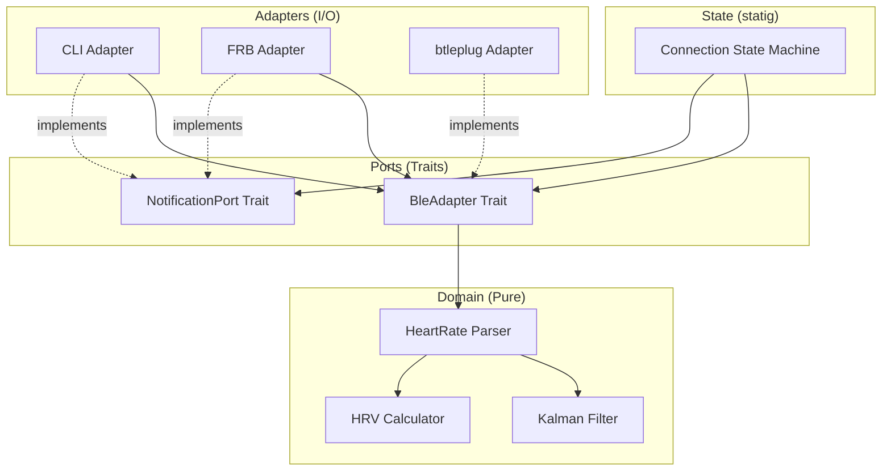

# Design Document

## Overview

The HR Telemetry feature implements the core BLE communication and signal processing pipeline for the Heart-Beat2 application. It follows a hexagonal architecture with Rust handling all domain logic and I/O abstraction, enabling both CLI debugging on Linux and mobile deployment via Flutter Rust Bridge.

## Steering Document Alignment

### Technical Standards (tech.md)
- **Rust Core**: All BLE communication, parsing, and filtering in Rust with Tokio async runtime
- **FRB v2**: StreamSink pattern for real-time data flow to Flutter
- **btleplug**: Primary BLE library with trait abstraction for swappability
- **statig**: Hierarchical state machine for connection management
- **Kalman filter**: Signal smoothing via kalman_filters crate

### Project Structure (structure.md)
- Domain logic in `rust/src/domain/` (no I/O dependencies)
- Port traits in `rust/src/ports/` (BleAdapter, NotificationPort)
- Adapters in `rust/src/adapters/` (btleplug implementation, mock)
- State machine in `rust/src/state/` (statig-based HSM)
- CLI binary in `rust/bin/cli.rs`

## Code Reuse Analysis

### Existing Components to Leverage
- **cardio-rs**: HRV calculation (RMSSD, SDNN) from RR-intervals
- **kalman_filters**: 1D Kalman filter for BPM smoothing
- **statig**: Hierarchical state machine framework
- **btleplug**: Cross-platform BLE abstraction

### Integration Points
- **FRB v2 StreamSink**: Rust → Dart real-time data channel
- **Tokio channels**: Internal async message passing
- **tracing**: Structured logging for debugging

## Architecture

The system follows hexagonal architecture (ports and adapters) to isolate domain logic from I/O concerns:

### Modular Design Principles
- **Single File Responsibility**: Each module handles one domain concept
- **Component Isolation**: BLE adapter, parser, filter, state machine are independent
- **Service Layer Separation**: Domain (pure), Ports (traits), Adapters (I/O)
- **Utility Modularity**: Parsing, filtering as pure functions



## Components and Interfaces

### Component 1: HeartRateMeasurement (Domain)
- **Purpose**: Parse BLE Heart Rate Measurement packets per Bluetooth SIG spec
- **Interfaces**:
  - `parse(data: &[u8]) -> Result<HeartRateMeasurement>`
  - `HeartRateMeasurement { bpm: u16, rr_intervals: Vec<u16>, sensor_contact: bool }`
- **Dependencies**: None (pure function)
- **Reuses**: Standard library only

### Component 2: KalmanFilter (Domain)
- **Purpose**: Apply 1D Kalman filtering to reduce BPM noise
- **Interfaces**:
  - `KalmanFilter::new(process_noise: f64, measurement_noise: f64) -> Self`
  - `filter.update(measurement: f64) -> f64`
- **Dependencies**: kalman_filters crate
- **Reuses**: kalman_filters::kalman1d

### Component 3: HrvCalculator (Domain)
- **Purpose**: Calculate HRV metrics from RR-intervals
- **Interfaces**:
  - `calculate_rmssd(rr_intervals: &[u16]) -> Option<f64>`
  - `calculate_sdnn(rr_intervals: &[u16]) -> Option<f64>`
- **Dependencies**: cardio-rs crate
- **Reuses**: cardio-rs HRV functions

### Component 4: BleAdapter (Port)
- **Purpose**: Abstract BLE operations for testability and swappability
- **Interfaces**:
  ```rust
  #[async_trait]
  pub trait BleAdapter: Send + Sync {
      async fn start_scan(&self) -> Result<()>;
      async fn stop_scan(&self) -> Result<()>;
      async fn get_discovered_devices(&self) -> Vec<DiscoveredDevice>;
      async fn connect(&self, device_id: &str) -> Result<()>;
      async fn disconnect(&self) -> Result<()>;
      async fn subscribe_hr(&self) -> Result<Receiver<Vec<u8>>>;
      async fn read_battery(&self) -> Result<u8>;
  }
  ```
- **Dependencies**: Domain types only
- **Reuses**: N/A (trait definition)

### Component 5: BtleplugAdapter (Adapter)
- **Purpose**: Implement BleAdapter using btleplug for real BLE communication
- **Interfaces**: Implements `BleAdapter` trait
- **Dependencies**: btleplug, tokio
- **Reuses**: btleplug::platform::Manager

### Component 6: MockAdapter (Adapter)
- **Purpose**: Provide simulated BLE data for testing without hardware
- **Interfaces**: Implements `BleAdapter` trait
- **Dependencies**: tokio (for timing)
- **Reuses**: N/A

### Component 7: ConnectionStateMachine (State)
- **Purpose**: Manage BLE connection lifecycle with well-defined states
- **Interfaces**:
  - `ConnectionStateMachine::new(adapter: Box<dyn BleAdapter>) -> Self`
  - `machine.handle(event: ConnectionEvent) -> Result<()>`
  - States: Idle, Scanning, Connecting, DiscoveringServices, Connected, Reconnecting
- **Dependencies**: statig, BleAdapter trait
- **Reuses**: statig::blocking::StateMachine

## Data Models

### HeartRateMeasurement
```rust
pub struct HeartRateMeasurement {
    pub bpm: u16,                    // Heart rate in beats per minute
    pub rr_intervals: Vec<u16>,      // RR-intervals in 1/1024 seconds
    pub sensor_contact: bool,        // Whether sensor has skin contact
}
```

### DiscoveredDevice
```rust
pub struct DiscoveredDevice {
    pub id: String,                  // Platform-specific device identifier
    pub name: Option<String>,        // Advertised device name
    pub rssi: i16,                   // Signal strength in dBm
}
```

### FilteredHeartRate
```rust
pub struct FilteredHeartRate {
    pub raw_bpm: u16,                // Unfiltered BPM from device
    pub filtered_bpm: u16,           // Kalman-filtered BPM
    pub rmssd: Option<f64>,          // HRV metric if RR-intervals available
    pub battery_level: Option<u8>,   // Device battery percentage
    pub timestamp: u64,              // Unix timestamp milliseconds
}
```

### ConnectionState (statig)
```rust
pub enum ConnectionState {
    Idle,
    Scanning,
    Connecting { device_id: String },
    DiscoveringServices,
    Connected,
    Reconnecting { attempts: u8 },
}
```

## Error Handling

### Error Scenarios
1. **BLE Scan Timeout**
   - **Handling**: Emit timeout event after 10 seconds; transition to Idle
   - **User Impact**: "No devices found" message displayed

2. **Connection Failed**
   - **Handling**: Retry up to 3 times with exponential backoff (1s, 2s, 4s)
   - **User Impact**: "Connecting..." with attempt count; "Connection failed" after retries exhausted

3. **Unexpected Disconnection**
   - **Handling**: Transition to Reconnecting; attempt reconnection up to 3 times
   - **User Impact**: "Reconnecting..." indicator; continue displaying last known BPM

4. **Invalid BLE Packet**
   - **Handling**: Log warning; skip packet; do not update filtered value
   - **User Impact**: No visible impact (filtered value unchanged)

5. **Physiologically Invalid BPM**
   - **Handling**: Reject values < 30 or > 220; log anomaly
   - **User Impact**: No visible impact (filtered value unchanged)

## Testing Strategy

### Unit Testing
- **Parser Tests (proptest)**: Generate random byte sequences; verify no panics; verify correct parsing for valid packets
- **Filter Tests**: Verify Kalman filter convergence; test edge cases (initial state, sudden changes)
- **HRV Tests**: Verify RMSSD/SDNN calculation against known values
- **Key Components**: `parse_heart_rate`, `KalmanFilter::update`, `calculate_rmssd`

### Integration Testing
- **State Machine Tests (mockall)**: Mock BleAdapter; verify state transitions for all event sequences
- **Pipeline Tests**: Mock adapter → parse → filter → output; verify end-to-end data flow
- **Key Flows**: Scan → Connect → Stream; Disconnect → Reconnect; Error recovery

### End-to-End Testing
- **CLI Testing**: Run CLI with mock adapter; verify stdout output format
- **Real Hardware**: Manual testing with Coospo HW9 on Linux
- **User Scenarios**: Full session (scan, connect, stream 5 min, disconnect)
