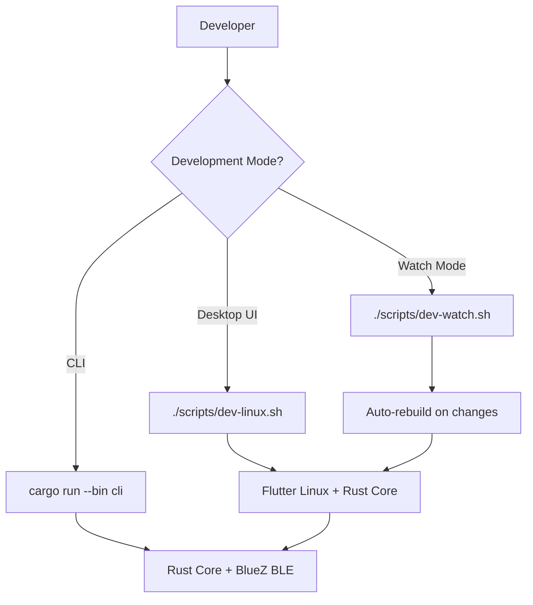

# Design Document

## Overview

Enable Flutter Linux desktop builds and create helper scripts for rapid development. The existing CLI binary provides non-UI testing capability.

## Steering Document Alignment

### Technical Standards (tech.md)
- CLI-first development approach
- btleplug uses BlueZ on Linux automatically
- Scripts follow existing patterns in scripts/

### Project Structure (structure.md)
- Linux Flutter files in `linux/` directory
- Scripts in `scripts/` directory
- CLI already exists at `rust/src/bin/cli.rs`

## Code Reuse Analysis

### Existing Components to Leverage
- **CLI binary**: Already implemented with devices/session/mock commands
- **btleplug**: Automatically uses BlueZ on Linux
- **scripts/**: Existing BLE scripts as reference

### Integration Points
- **Flutter Linux**: Standard Flutter desktop setup
- **Rust library**: Load from target/release/libheart_beat.so

## Architecture

## Components and Interfaces

### dev-linux.sh Script
- **Purpose:** One-command build and run for Linux
- **Interfaces:** `./scripts/dev-linux.sh [--release]`
- **Steps:**
  1. Build Rust library
  2. Run flutter run -d linux

### dev-watch.sh Script
- **Purpose:** Auto-rebuild on Rust changes
- **Interfaces:** `./scripts/dev-watch.sh`
- **Dependencies:** cargo-watch (install with `cargo install cargo-watch`)

### Flutter Linux Configuration
- **Purpose:** Enable desktop builds
- **Files:** linux/CMakeLists.txt, linux/runner/

## Error Handling

### Error Scenarios
1. **Linux dependencies missing:**
   - Handling: Check and list missing deps
   - User Impact: Clear instructions to install

2. **Bluetooth not available:**
   - Handling: Error message suggesting BlueZ check
   - User Impact: BLE features unavailable

## Testing Strategy

### Integration Testing
- Test `flutter run -d linux` launches app
- Test CLI BLE scan finds devices
- Test dev scripts work correctly
