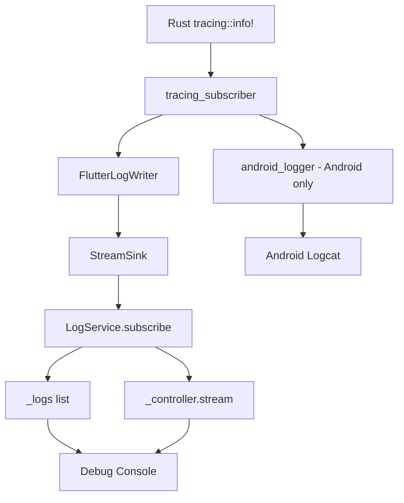

# Design Document

## Overview

Create a dual-output logging system that sends Rust logs to both Flutter (via FRB StreamSink) and Android logcat (via android_logger crate). Flutter LogService manages log storage and distribution.

## Steering Document Alignment

### Technical Standards (tech.md)
- Uses existing tracing infrastructure
- Follows hexagonal architecture (logging as infrastructure)
- Singleton pattern for LogService

### Project Structure (structure.md)
- Rust changes in `rust/src/api.rs`
- New Flutter service in `lib/src/services/log_service.dart`
- Flutter init in `lib/main.dart`

## Code Reuse Analysis

### Existing Components to Leverage
- **api.rs init_logging**: Already implemented, just needs to be called
- **api.rs init_panic_handler**: Already implemented, just needs to be called
- **LogMessage struct**: Already defined in api.rs
- **FlutterLogWriter**: Already implemented for StreamSink output

### Integration Points
- **main.dart**: Initialize logging on startup
- **android_logger**: New crate for logcat output

## Architecture



## Components and Interfaces

### LogService (Flutter)
- **Purpose:** Centralized log management singleton
- **Interfaces:**
  - `static LogService instance` - singleton access
  - `void subscribe(Stream<LogMessage>)` - connect to Rust stream
  - `Stream<LogMessage> get stream` - broadcast stream for listeners
  - `List<LogMessage> get logs` - all stored logs
  - `void clear()` - clear log buffer
- **Dependencies:** StreamController, foundation.dart

### android_logger Integration (Rust)
- **Purpose:** Output logs to Android logcat
- **Interfaces:** Integrated via tracing_subscriber layer
- **Dependencies:** android_logger crate

## Data Models

### LogMessage (existing)
```rust
pub struct LogMessage {
    pub level: String,      // TRACE, DEBUG, INFO, WARN, ERROR
    pub target: String,     // Module path
    pub timestamp: u64,     // Unix epoch ms
    pub message: String,    // Log content
}
```

## Error Handling

### Error Scenarios
1. **init_logging called twice:**
   - Handling: Return error, tracing subscriber already set
   - User Impact: None, log warning

2. **StreamSink closed:**
   - Handling: Ignore send errors in FlutterLogWriter
   - User Impact: Logs stop appearing in Flutter but logcat continues

## Testing Strategy

### Unit Testing
- Test LogService stores and broadcasts logs
- Test log buffer limiting

### Integration Testing
- Verify logs appear in Flutter debug console
- Verify logs appear in adb logcat
