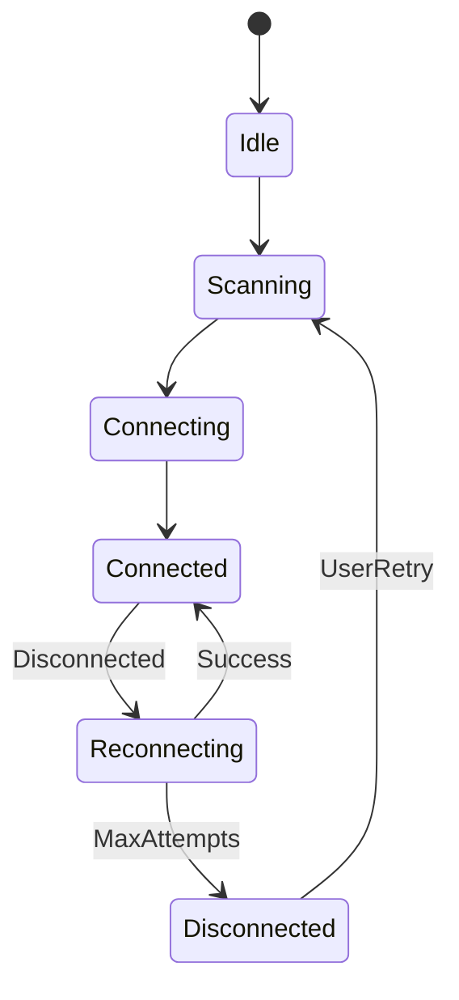

# Design Document

## Overview

Reconnection handling extends the existing connectivity state machine with automatic reconnection attempts, exponential backoff, and session preservation during disconnection events.

## Steering Document Alignment

### Technical Standards (tech.md)
- Uses statig state machine (already in connectivity.rs)
- Async reconnection via tokio
- NotificationPort for connection status events

### Project Structure (structure.md)
- State machine in `rust/src/state/connectivity.rs`
- Reconnection logic in `rust/src/adapters/btleplug_adapter.rs`
- UI feedback in Flutter screens

## Code Reuse Analysis

### Existing Components to Leverage
- **ConnectivityStateMachine**: Already has Reconnecting state
- **BtleplugAdapter**: Has connection methods
- **NotificationPort**: Has ConnectionLost event
- **SessionExecutor**: Has pause/resume functionality

### Integration Points
- **State Machine**: Extend Reconnecting state with attempt tracking
- **Session**: Trigger pause on disconnect, resume on reconnect
- **Flutter UI**: Observe connection state stream

## Architecture



## Components and Interfaces

### ReconnectionPolicy
- **Purpose:** Configure reconnection behavior
- **Fields:** max_attempts, initial_delay_ms, backoff_multiplier
- **Defaults:** 5 attempts, 1000ms initial, 2x multiplier

### Extended ConnectivityStateMachine
- **Purpose:** Track reconnection attempts
- **New State Data:** attempt_count, last_device_id
- **Events:** ReconnectAttempt, ReconnectSuccess, ReconnectFailed

### Connection Status Stream
- **Purpose:** Real-time connection state for UI
- **Events:** Connected, Disconnected, Reconnecting(attempt), ReconnectFailed

### Session Integration
- **Purpose:** Pause/resume on connection changes
- **Behavior:** Auto-pause on disconnect, auto-resume on reconnect

## Data Models

### ConnectionStatus
```rust
pub enum ConnectionStatus {
    Disconnected,
    Connecting,
    Connected { device_id: String },
    Reconnecting { attempt: u8, max_attempts: u8 },
    ReconnectFailed { reason: String },
}
```

### ReconnectionPolicy
```rust
pub struct ReconnectionPolicy {
    pub max_attempts: u8,
    pub initial_delay: Duration,
    pub backoff_multiplier: f32,
    pub max_delay: Duration,
}
```

## Error Handling

### Error Scenarios
1. **Device Out of Range**
   - **Handling:** Retry with exponential backoff
   - **User Impact:** "Reconnecting... Move closer to device"

2. **Device Powered Off**
   - **Handling:** Fail after max attempts
   - **User Impact:** "Could not reconnect. Check device power."

3. **BLE Adapter Error**
   - **Handling:** Notify user, offer restart
   - **User Impact:** "Bluetooth error. Please restart Bluetooth."

## Testing Strategy

### Unit Testing
- Test exponential backoff timing
- Test attempt counter reset on success
- Test max attempt limit

### Integration Testing
- Test reconnection with mock adapter simulating disconnect
- Test session pause/resume on disconnect/reconnect

### Manual Testing
- Test with real device by moving out of range
- Verify background reconnection on Android
