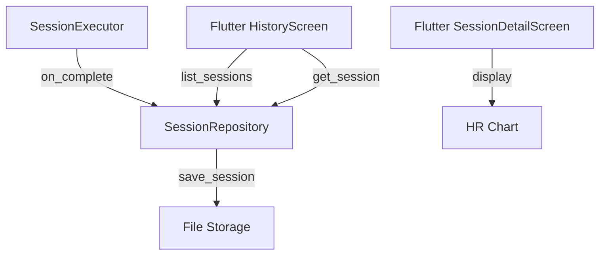

# Design Document

## Overview

Session history provides persistent storage for completed workout sessions with listing and detail views in the Flutter UI. Sessions are stored as JSON files in the local filesystem.

## Steering Document Alignment

### Technical Standards (tech.md)
- JSON for configuration and data storage (as specified)
- Hexagonal architecture with SessionRepository port
- Rust handles storage logic, Flutter handles display

### Project Structure (structure.md)
- Storage logic in `rust/src/adapters/session_storage.rs`
- Repository trait in `rust/src/ports/session_repository.rs`
- Flutter screens in `lib/src/screens/history_screen.dart`

## Code Reuse Analysis

### Existing Components to Leverage
- **SessionExecutor**: Already tracks session progress, add save on complete
- **TrainingPlan**: Serialize with session for reference
- **serde_json**: Already used for training plan serialization

### Integration Points
- **SessionExecutor**: Hook into session complete/interrupt events
- **Flutter Navigation**: Add history screen to app routes

## Architecture



## Components and Interfaces

### CompletedSession Domain Type
- **Purpose:** Represent a saved session
- **Fields:** id, plan_name, start_time, end_time, status, hr_samples, phases
- **Dependencies:** TrainingPlan types

### SessionRepository Port
- **Purpose:** Abstract session storage
- **Interfaces:** `save()`, `list()`, `get(id)`, `delete(id)`
- **Dependencies:** None (trait only)

### FileSessionRepository Adapter
- **Purpose:** JSON file-based storage
- **Interfaces:** Implements SessionRepository
- **Dependencies:** serde_json, std::fs
- **Reuses:** Similar patterns to training plan file loading

### Flutter HistoryScreen
- **Purpose:** Display session list
- **Interfaces:** ListView of sessions
- **Dependencies:** api.rs FFI calls

### Flutter SessionDetailScreen
- **Purpose:** Show session details with HR graph
- **Dependencies:** fl_chart for HR visualization

## Data Models

### CompletedSession
```rust
pub struct CompletedSession {
    pub id: String,              // UUID
    pub plan_name: String,
    pub start_time: DateTime<Utc>,
    pub end_time: DateTime<Utc>,
    pub status: SessionStatus,   // Completed, Interrupted, Stopped
    pub hr_samples: Vec<HrSample>,
    pub phases_completed: Vec<PhaseResult>,
    pub summary: SessionSummary,
}

pub struct SessionSummary {
    pub duration_secs: u64,
    pub avg_hr: u16,
    pub max_hr: u16,
    pub min_hr: u16,
    pub time_in_zone: HashMap<Zone, u64>,
}
```

### Storage Format
```
~/.heart-beat/sessions/
  2026-01-12_tempo-run_abc123.json
  2026-01-11_recovery_def456.json
```

## Error Handling

### Error Scenarios
1. **Storage Full**
   - **Handling:** Return error, session remains in memory
   - **User Impact:** Toast notification "Could not save session"

2. **Corrupted Session File**
   - **Handling:** Skip file, log warning, continue loading others
   - **User Impact:** Corrupted session not shown in list

## Testing Strategy

### Unit Testing
- Test CompletedSession serialization round-trip
- Test SessionSummary calculation

### Integration Testing
- Test save/list/get/delete cycle with temp directory
- Test session executor integration
