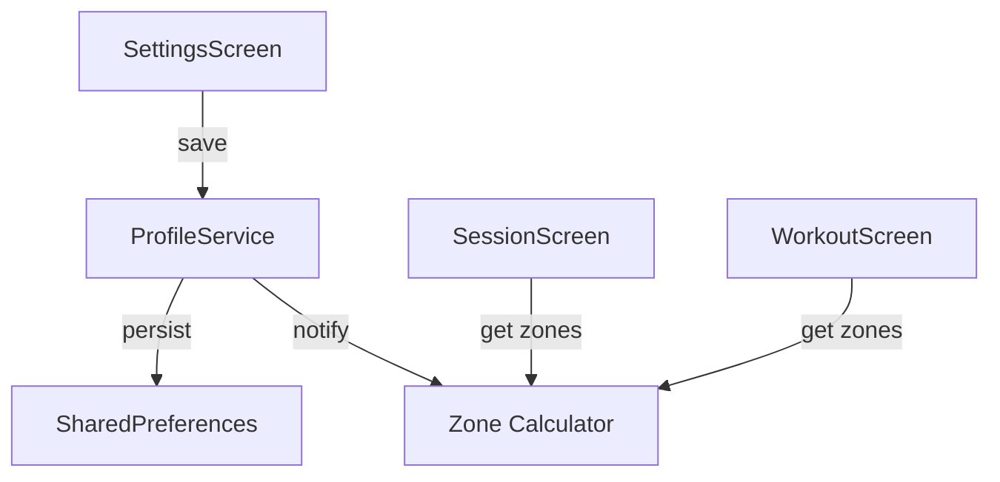

# Design Document

## Overview

User profile stores and manages athlete settings for personalized training zone calculations. The profile is persisted locally and drives all zone-related features.

## Steering Document Alignment

### Technical Standards (tech.md)
- Local storage via SharedPreferences (Flutter) or JSON file (Rust)
- Pure domain logic for zone calculation
- Settings screen already exists, needs enhancement

### Project Structure (structure.md)
- Domain type in `rust/src/domain/user_profile.rs`
- Flutter storage via SharedPreferences (already configured)
- Settings screen in `lib/src/screens/settings_screen.dart`

## Code Reuse Analysis

### Existing Components to Leverage
- **settings_screen.dart**: Already has max HR input, extend for full profile
- **SharedPreferences**: Already used for max HR storage
- **calculate_zone()**: Existing function in heart_rate.rs, extend for custom zones

### Integration Points
- **Zone calculation**: Use profile max HR and custom zones
- **Session display**: Show zones based on profile
- **WorkoutScreen**: Phase target zones from profile

## Architecture



## Components and Interfaces

### UserProfile Domain Type
- **Purpose:** Athlete settings
- **Fields:** max_hr, age, use_age_based, custom_zones, unit_preference
- **Dependencies:** Zone type

### ProfileService (Flutter)
- **Purpose:** Profile CRUD and persistence
- **Interfaces:** `loadProfile()`, `saveProfile(profile)`, `getZones()`
- **Dependencies:** SharedPreferences

### Custom Zone Configuration
- **Purpose:** Override default zone thresholds
- **Fields:** zone1_max, zone2_max, zone3_max, zone4_max (zone5 is max HR)

## Data Models

### UserProfile
```dart
class UserProfile {
  final int maxHr;
  final int? age;
  final bool useAgeBased;
  final CustomZones? customZones;
  final UnitPreference units; // Metric/Imperial
}

class CustomZones {
  final int zone1Max; // % of max HR
  final int zone2Max;
  final int zone3Max;
  final int zone4Max;
  // Zone 5 is zone4Max to 100%
}
```

### Default Zone Thresholds
```
Zone 1: 50-60% (Recovery)
Zone 2: 60-70% (Endurance)
Zone 3: 70-80% (Tempo)
Zone 4: 80-90% (Threshold)
Zone 5: 90-100% (Max)
```

## Error Handling

### Error Scenarios
1. **Invalid Max HR**
   - **Handling:** Show validation error, don't save
   - **User Impact:** "Max HR must be between 100-220"

2. **Overlapping Zones**
   - **Handling:** Reject configuration
   - **User Impact:** "Zone boundaries must be in ascending order"

## Testing Strategy

### Unit Testing
- Test zone calculation with various max HR
- Test custom zone threshold validation
- Test age-based max HR formula

### Integration Testing
- Test profile save/load cycle
- Test zone recalculation on profile change
