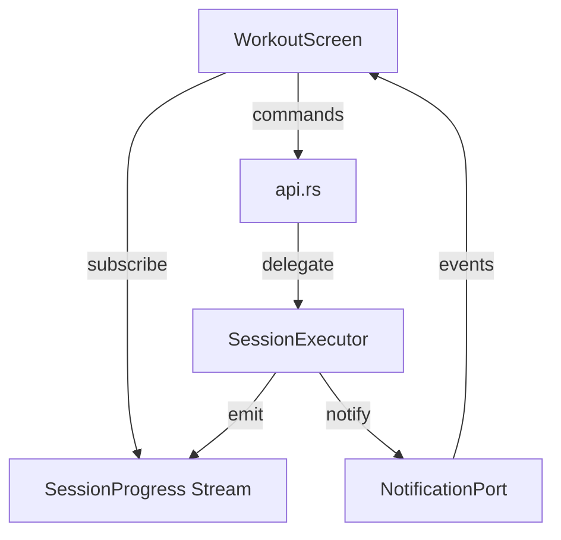

# Design Document

## Overview

Workout execution adds active workout tracking UI on top of the existing SessionExecutor and session state machine. The Flutter UI observes session state and provides real-time feedback to the athlete.

## Steering Document Alignment

### Technical Standards (tech.md)
- Uses StreamSink from Rust to Flutter for real-time updates
- Session state machine (statig) drives all transitions
- NotificationPort emits zone deviation events

### Project Structure (structure.md)
- UI in `lib/src/screens/workout_screen.dart`
- Widgets in `lib/src/widgets/phase_progress.dart`, `zone_feedback.dart`
- Integrates with existing session module in Rust

## Code Reuse Analysis

### Existing Components to Leverage
- **SessionStateMachine**: Already implements phase transitions
- **SessionExecutor**: Orchestrates session, emits progress
- **NotificationPort**: Zone deviation notifications already defined
- **ZoneIndicator widget**: Exists, can be enhanced

### Integration Points
- **api.rs**: Add session control functions and progress stream
- **session_screen.dart**: Extend or replace with workout_screen.dart

## Architecture



## Components and Interfaces

### SessionProgress Domain Type
- **Purpose:** Real-time session state for UI
- **Fields:** current_phase, phase_elapsed, phase_remaining, total_elapsed, zone_status, is_paused
- **Dependencies:** TrainingPhase types

### Session Control API
- **Purpose:** Control session from Flutter
- **Interfaces:** `start_session(plan)`, `pause_session()`, `resume_session()`, `stop_session()`
- **Reuses:** SessionExecutor methods

### WorkoutScreen Flutter
- **Purpose:** Main workout execution UI
- **Widgets:** PhaseProgress, ZoneFeedback, SessionControls, HrDisplay
- **Dependencies:** SessionProgress stream

### PhaseProgressWidget
- **Purpose:** Show current phase and upcoming phases
- **Display:** Linear progress bar, phase name, time remaining

### ZoneFeedbackWidget
- **Purpose:** Visual/audio zone deviation alerts
- **Display:** "Speed Up"/"Slow Down" overlay, color flash

## Data Models

### SessionProgress
```rust
pub struct SessionProgress {
    pub state: SessionState,        // Idle, InProgress, Paused, Completed
    pub current_phase: Option<PhaseProgress>,
    pub total_elapsed_secs: u64,
    pub total_remaining_secs: u64,
    pub zone_status: ZoneStatus,    // InZone, TooLow, TooHigh
    pub current_bpm: Option<u16>,
}

pub struct PhaseProgress {
    pub phase_index: usize,
    pub phase_name: String,
    pub target_zone: Zone,
    pub elapsed_secs: u64,
    pub remaining_secs: u64,
}
```

## Error Handling

### Error Scenarios
1. **Plan Not Found**
   - **Handling:** Show error dialog, return to plan selection
   - **User Impact:** "Training plan not found" message

2. **BLE Disconnection During Workout**
   - **Handling:** Pause session, show reconnection UI
   - **User Impact:** "Connection lost - attempting reconnect" banner

## Testing Strategy

### Unit Testing
- Test SessionProgress serialization
- Test zone status transitions (5-second threshold)

### Integration Testing
- Test full session flow: start -> phases -> complete
- Test pause/resume preserves state

### Manual Testing
- Test on device during actual workout
- Verify audio notifications are audible
