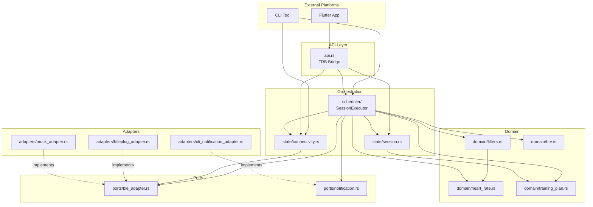
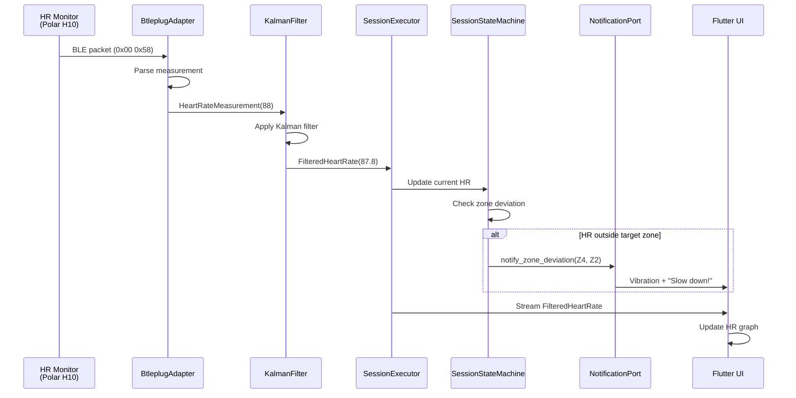
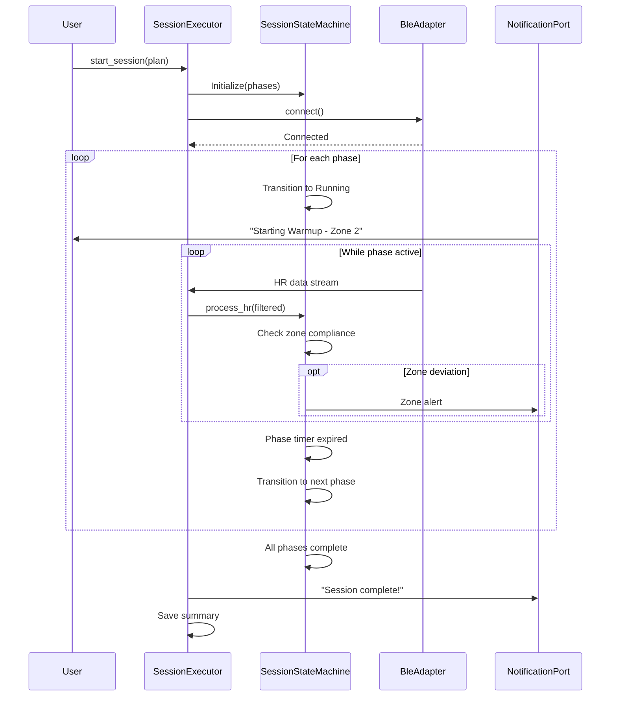

# Architecture Documentation

## Table of Contents
- [Overview](#overview)
- [Hexagonal Architecture](#hexagonal-architecture)
- [Module Breakdown](#module-breakdown)
- [Dependency Graph](#dependency-graph)
- [Data Flow](#data-flow)
- [State Machines](#state-machines)
- [Key Design Decisions](#key-design-decisions)
- [Adding New Features](#adding-new-features)

## Overview

Heart Beat uses **hexagonal architecture** (ports and adapters pattern) to achieve:

- **Domain isolation** - Business logic independent of external dependencies
- **Platform independence** - Rust core runs on CLI, Android, iOS, desktop
- **Testability** - Mock implementations for all external interfaces
- **Flexibility** - Swap BLE libraries, notification systems, or platforms without touching domain code

### Architecture Principles

1. **Domain-centric** - Business rules in `domain/`, free of infrastructure concerns
2. **Dependency inversion** - Ports (traits) define contracts, adapters implement them
3. **State machines** - Explicit state modeling using `statig` for robustness
4. **CLI-first** - Rich terminal tool enables rapid development without mobile builds
5. **Type safety** - Compile-time guarantees via Rust's type system

## Hexagonal Architecture

```
┌─────────────────────────────────────────────────────────────┐
│                         Adapters                            │
│  (External World - Infrastructure Implementations)          │
├─────────────────────────────────────────────────────────────┤
│                                                              │
│  BtleplugAdapter    MockAdapter    CliNotificationAdapter   │
│  (Real BLE)         (Testing)      (Terminal output)        │
│                                                              │
└──────────────────────┬──────────────────────────────────────┘
                       │
                  Implements
                       │
                       ▼
┌─────────────────────────────────────────────────────────────┐
│                          Ports                              │
│          (Trait Interfaces - Contracts)                     │
├─────────────────────────────────────────────────────────────┤
│                                                              │
│  BleAdapter trait     NotificationPort trait                │
│                                                              │
└──────────────────────┬──────────────────────────────────────┘
                       │
                   Used by
                       │
                       ▼
┌─────────────────────────────────────────────────────────────┐
│                         Domain                              │
│       (Business Logic - Core Application)                   │
├─────────────────────────────────────────────────────────────┤
│                                                              │
│  HeartRate    TrainingPlan    KalmanFilter    HRV           │
│                                                              │
└──────────────────────┬──────────────────────────────────────┘
                       │
               Orchestrated by
                       │
                       ▼
┌─────────────────────────────────────────────────────────────┐
│                   State & Scheduler                         │
│              (Orchestration Layer)                          │
├─────────────────────────────────────────────────────────────┤
│                                                              │
│  ConnectionStateMachine    SessionStateMachine              │
│  SessionExecutor                                            │
│                                                              │
└─────────────────────────────────────────────────────────────┘
```

**Flow:** External events → Adapters → Ports → Domain → State/Scheduler → Ports → Adapters → External actions

## Module Breakdown

### `domain/` - Business Logic

**Responsibility:** Pure domain types and algorithms, no dependencies on infrastructure.

**Files:**
- `heart_rate.rs` - HR data types, BLE parsing, zone calculations
- `filters.rs` - Kalman filter for noise reduction
- `hrv.rs` - Heart rate variability analysis (RMSSD, SDNN)
- `training_plan.rs` - Training plan data model, phases, zones

**Key Types:**
```rust
HeartRateMeasurement   // Raw BLE measurement
FilteredHeartRate      // Kalman-filtered HR with metadata
Zone                   // HR zones (Z1-Z5)
TrainingPlan           // Structured workout definition
Phase                  // Individual workout segment
```

**Constraints:**
- No `async` code (pure functions)
- No external I/O
- No platform-specific code
- 100% unit testable without mocks

### `ports/` - Trait Interfaces

**Responsibility:** Define contracts for external dependencies.

**Files:**
- `ble_adapter.rs` - BLE operations (scan, connect, stream)
- `notification.rs` - User notifications (audio, vibration, visual)

**Key Traits:**
```rust
pub trait BleAdapter {
    async fn scan_devices(&self) -> Result<Vec<DiscoveredDevice>>;
    async fn connect(&mut self, device_id: &str) -> Result<()>;
    async fn stream_heart_rate(&self) -> Result<Receiver<HeartRateMeasurement>>;
    async fn disconnect(&mut self) -> Result<()>;
}

pub trait NotificationPort {
    async fn notify_zone_deviation(&self, current: Zone, target: Zone);
    async fn notify_phase_change(&self, phase_name: &str);
}
```

**Why separate ports?**
- Enables testing with mocks
- Swappable implementations (btleplug → bluez, etc.)
- Platform-specific adapters (Android service, iOS, CLI)

### `adapters/` - Implementations

**Responsibility:** Concrete implementations of port traits.

**Files:**
- `btleplug_adapter.rs` - Real BLE via btleplug library
- `mock_adapter.rs` - Simulated HR data for testing
- `cli_notification_adapter.rs` - Terminal output notifications
- `mock_notification_adapter.rs` - Test notification capture

**Adapter Selection:**
```rust
// Production Android
let adapter = BtleplugAdapter::new();

// Development CLI
let adapter = MockAdapter::new();
```

**Testing Strategy:**
- Unit tests use `MockAdapter` for deterministic behavior
- Integration tests use `BtleplugAdapter` with real devices
- CLI uses mock by default, real adapter with `--device` flag

### `state/` - State Machines

**Responsibility:** Manage application lifecycle and session execution.

**Files:**
- `connectivity.rs` - BLE connection state machine
- `session.rs` - Training session execution state machine

**Connection States:**
```
Idle → Scanning → Connecting → Connected → Streaming
  ↑        ↓          ↓           ↓           ↓
  └────────┴──────────┴───────────┴───────────┘
              Disconnected/Error
```

**Session States:**
```
Ready → Running → Paused → Completed
  ↑       ↓         ↓
  └───────┴─────────┘
      Stopped
```

**Why state machines?**
- Explicit, compile-checked state transitions
- Prevents invalid states (e.g., streaming while disconnected)
- Clear error handling and recovery paths
- Type-safe event handling with `statig`

### `scheduler/` - Orchestration

**Responsibility:** Execute training plans by coordinating state machines and adapters.

**Files:**
- `executor.rs` - Session orchestration logic
- `mod.rs` - Public API and types

**Key Type:**
```rust
pub struct SessionExecutor {
    plan: TrainingPlan,
    ble_adapter: Arc<dyn BleAdapter>,
    notifier: Arc<dyn NotificationPort>,
    filter: KalmanFilter,
}
```

**Workflow:**
1. Load `TrainingPlan` from JSON
2. Connect to BLE device via `BleAdapter`
3. Execute phases sequentially
4. Filter HR data with `KalmanFilter`
5. Detect zone deviations, trigger `NotificationPort`
6. Transition phases, handle session state
7. Persist session summary on completion

### `api.rs` - Flutter Bridge

**Responsibility:** Expose Rust functions to Dart via flutter_rust_bridge.

**Functions:**
```rust
#[frb(sync)]
pub fn scan_devices() -> Result<Vec<DiscoveredDevice>>;

pub fn connect_device(device_id: String) -> Result<()>;
pub fn start_mock_mode(config: MockConfig) -> Result<()>;
pub fn create_hr_stream() -> impl Stream<FilteredHeartRate>;
```

**Bridge Pattern:**
- `#[frb]` macros generate Dart bindings automatically
- Async Rust functions → Dart Futures
- Rust Streams → Dart Streams
- Serialization handled by FRB codegen

## Dependency Graph



**Dependency Rules:**
1. Domain depends on nothing (pure logic)
2. Ports depend only on domain types
3. Adapters depend on ports (implement traits)
4. State machines depend on domain and ports
5. Scheduler orchestrates everything
6. API exposes scheduler and state to Flutter

## Data Flow

### BLE Packet → Filtered HR → UI



### Training Session Execution



## State Machines

### Connection State Machine

**States:**
```rust
pub enum ConnectionState {
    Idle,
    Scanning { devices: Vec<DiscoveredDevice> },
    Connecting { device_id: String },
    Connected { device_id: String },
    Streaming { device_id: String },
    Disconnected,
}
```

**Events:**
```rust
pub enum ConnectionEvent {
    StartScan,
    DeviceFound(DiscoveredDevice),
    Connect(String),
    Connected,
    StartStream,
    Disconnect,
    Error(String),
}
```

**Transition Rules:**
- `Idle + StartScan → Scanning`
- `Scanning + Connect(id) → Connecting`
- `Connecting + Connected → Connected`
- `Connected + StartStream → Streaming`
- `Any + Disconnect → Disconnected`
- `Any + Error → Disconnected`

### Session State Machine

**States:**
```rust
pub enum SessionState {
    Ready { plan: TrainingPlan },
    Running { plan: TrainingPlan, current_phase: usize, elapsed: Duration },
    Paused { plan: TrainingPlan, current_phase: usize, elapsed: Duration },
    Completed { summary: SessionSummary },
}
```

**Events:**
```rust
pub enum SessionEvent {
    Start,
    Pause,
    Resume,
    Stop,
    PhaseComplete,
    HeartRateUpdate(FilteredHeartRate),
}
```

**Transition Rules:**
- `Ready + Start → Running(phase 0)`
- `Running + Pause → Paused`
- `Paused + Resume → Running`
- `Running + PhaseComplete → Running(next phase)` or `Completed`
- `Any + Stop → Ready`

## Key Design Decisions

### Why Hexagonal Architecture?

**Problem:** Tightly coupled BLE code makes testing impossible without physical devices.

**Solution:** Define `BleAdapter` trait, inject implementations.

**Benefit:**
- Unit tests use `MockAdapter` (instant, deterministic)
- Integration tests use `BtleplugAdapter` (real devices)
- CLI defaults to mock mode for rapid development

### Why `statig` for State Machines?

**Alternatives considered:**
- Hand-written enums (error-prone, no compile-time transition checks)
- `rust-fsm` (runtime state machine, less type-safe)

**Why `statig`:**
- Compile-time state transition validation
- Zero-cost abstractions (no runtime overhead)
- Clear, explicit state modeling
- Type-safe event handling

**Trade-off:** More verbose code, but eliminates entire classes of bugs.

### Why flutter_rust_bridge v2?

**Alternatives:**
- Dart FFI directly (manual serialization, error-prone)
- Platform channels (Dart ↔ Kotlin/Swift ↔ Rust, 3-layer overhead)

**Why FRB v2:**
- Auto-generates Dart bindings from Rust code
- Supports async (Futures), streams, complex types
- Type-safe serialization
- Hot-reload compatible

**Performance:** ~10-50μs overhead per call (negligible for HR monitoring)

### Why CLI-First Development?

**Traditional:** Flutter app → build APK → deploy → test (5+ min cycle)

**CLI-First:** Rust changes → `cargo run` → test (<10s cycle)

**Benefits:**
- 30x faster iteration
- No emulator/device needed
- Easy debugging with println/logs
- Rich terminal UI with colors, tables, progress bars

**CLI Features:**
- `devices scan` - List BLE devices
- `session start` - Execute training plan
- `mock steady --bpm 140` - Simulate HR patterns
- `plan create` - Interactive plan builder

### Why Kalman Filtering?

**Problem:** BLE HR sensors have ±3-5 BPM jitter, causing false zone alerts.

**Solution:** Kalman filter smooths data while preserving responsiveness.

**Tuning:**
- Process noise (`q`): 0.1 (low, assumes HR changes slowly)
- Measurement noise (`r`): 2.0 (moderate, BLE data has some noise)

**Result:** Smooth output, ~1s lag, eliminates spurious alerts.

## Adding New Features

### Example: Add Cadence Monitoring

**1. Domain (Pure Logic)**
```rust
// domain/cadence.rs
pub struct CadenceData {
    pub steps_per_minute: u16,
    pub timestamp: SystemTime,
}

pub fn parse_cadence(ble_data: &[u8]) -> Result<CadenceData> {
    // Parse BLE Running Speed and Cadence service
}
```

**2. Port (Interface)**
```rust
// ports/cadence_adapter.rs
#[async_trait]
pub trait CadenceAdapter {
    async fn stream_cadence(&self) -> Result<Receiver<CadenceData>>;
}
```

**3. Adapter (Implementation)**
```rust
// adapters/btleplug_cadence_adapter.rs
pub struct BtleplugCadenceAdapter { /* ... */ }

impl CadenceAdapter for BtleplugCadenceAdapter {
    async fn stream_cadence(&self) -> Result<Receiver<CadenceData>> {
        // Subscribe to 0x1816 Running Speed and Cadence service
    }
}
```

**4. State/Scheduler (Orchestration)**
```rust
// scheduler/executor.rs
pub struct SessionExecutor {
    cadence_adapter: Option<Arc<dyn CadenceAdapter>>, // Add field
}

impl SessionExecutor {
    pub async fn start_session(&mut self) {
        // Stream cadence alongside HR
        if let Some(cadence) = &self.cadence_adapter {
            let cadence_rx = cadence.stream_cadence().await?;
            // Process cadence data
        }
    }
}
```

**5. API (Expose to Flutter)**
```rust
// api.rs
#[frb]
pub fn create_cadence_stream() -> impl Stream<CadenceData> {
    // Expose cadence stream to Dart
}
```

**6. Tests**
```rust
// tests/cadence_integration.rs
#[tokio::test]
async fn test_cadence_stream() {
    let adapter = MockCadenceAdapter::new();
    // Test cadence parsing and streaming
}
```

### Where to Add Code

| Feature Type | Module | Example |
|--------------|--------|---------|
| New domain logic | `domain/` | HRV metrics, power zones |
| External dependency | `ports/` + `adapters/` | GPS, cadence, power meter |
| State management | `state/` | Race mode, interval timer |
| Orchestration | `scheduler/` | Multi-sensor fusion |
| Flutter API | `api.rs` | New data streams, commands |
| CLI command | `bin/cli.rs` | `cadence monitor` |

### Testing Strategy

1. **Unit tests** - Pure domain logic (no mocks needed)
2. **Integration tests** - With `MockAdapter` (fast, deterministic)
3. **CLI tests** - Manual testing via rich terminal UI
4. **E2E tests** - Real BLE devices (slow, run in CI only)

---

**Next:** See [development.md](development.md) for setup and contribution workflow.
